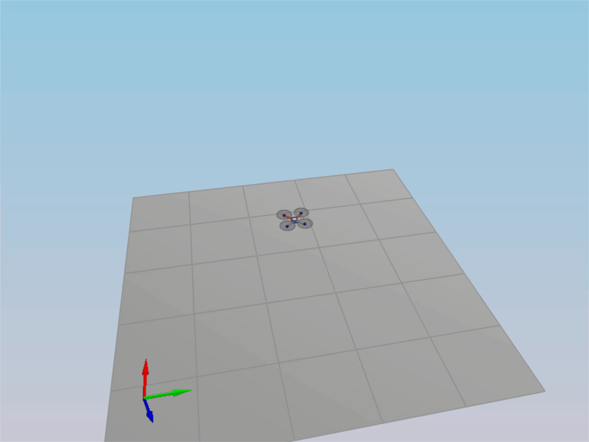
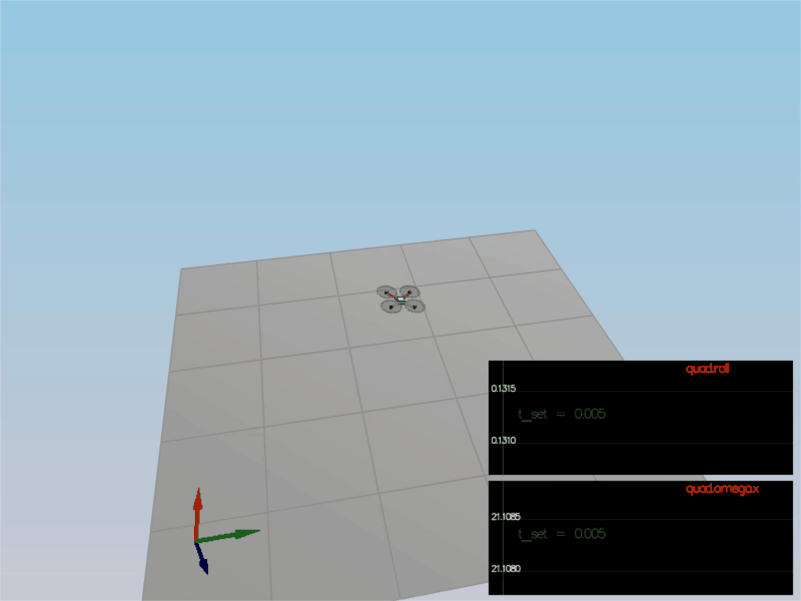
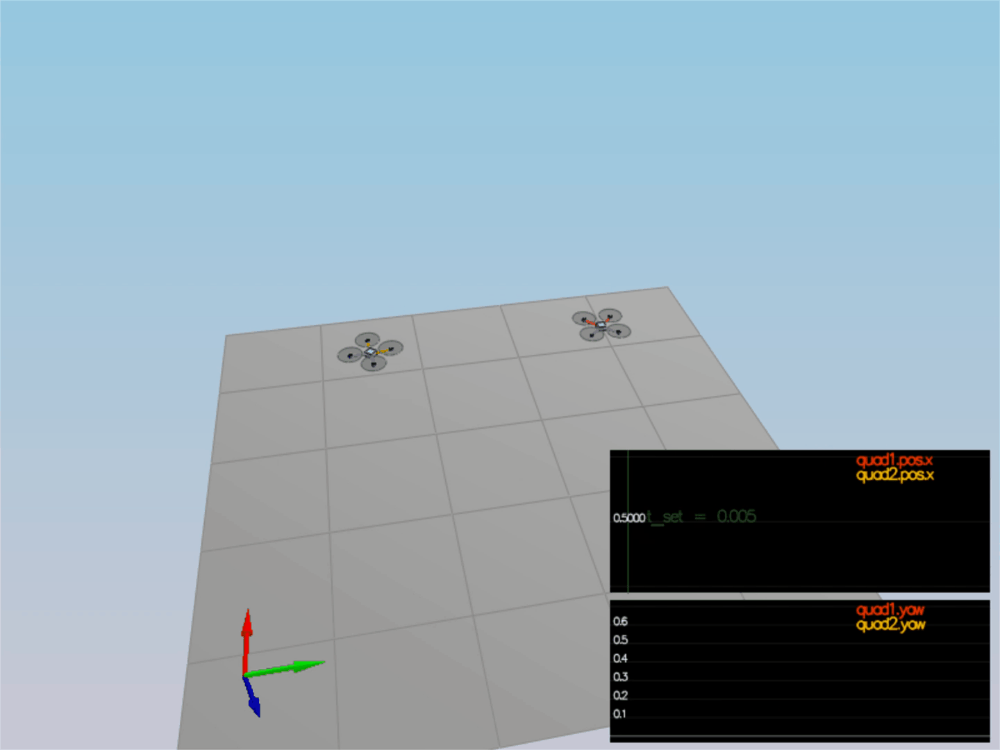
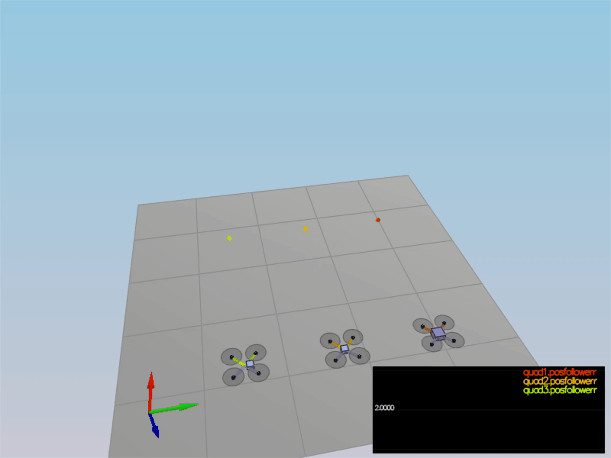
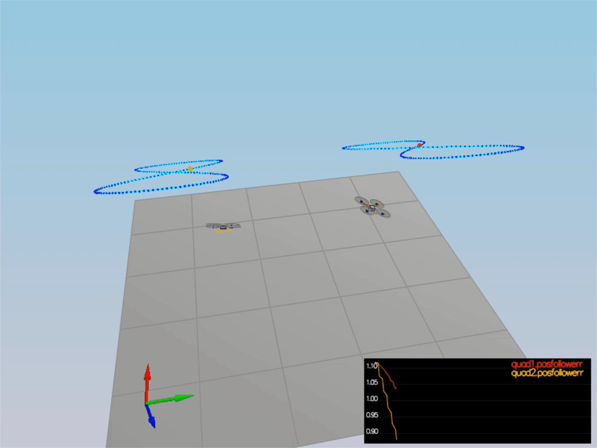

# Writeup — 3D Quadrotor Controller (C++)

This document is the project writeup for the cascaded quadrotor controller implemented in
[QuadControl.cpp](src/QuadControl.cpp). Every rubric point is listed below with the exact
code location that addresses it, the math behind it, and the gains used
([QuadControlParams.txt](config/QuadControlParams.txt)).

All five student-code blocks live between the `BEGIN STUDENT CODE` / `END STUDENT CODE`
markers of the six controller methods; nothing outside those blocks was modified.

---

## Controller architecture

`RunControl()` ([QuadControl.cpp:305-322](src/QuadControl.cpp#L305-L322)) wires the cascade
together. The slow outer loops produce setpoints for the fast inner loops:

```
trajectory point
   │
   ├─ z, vz, az ──► AltitudeControl ──────────────► collThrustCmd [N]
   │                                                     │  (clipped to leave 10% thrust
   │                                                     │   margin for attitude control)
   ├─ x,y, vxy, axy ► LateralPositionControl ► accelCmd  │
   │                                             │       │
   │                                             └──► RollPitchControl ──► p_cmd, q_cmd
   │                                                                            │
   └─ yaw ────────────────────────► YawControl ──────────────────────► r_cmd    │
                                                                            │   │
                                                          BodyRateControl ◄──┴───┘
                                                                    │ momentCmd [N·m]
                                                     GenerateMotorCommands
                                                                    │
                                                   desiredThrustsN[0..3] [N]
```

Loop rates follow the usual 5× rule of thumb: body rate (inner) is the stiffest gain,
then attitude, then velocity, then position.

---

## Rubric point 1 — Body rate control

**Code:** `BodyRateControl()` — [QuadControl.cpp:114-129](src/QuadControl.cpp#L114-L129)

A pure proportional controller on body rates, converted into moments through the inertia
tensor so the output is a torque and not a raw rate error:

```
      p_err = pqr_cmd − pqr
    momentCmd = I · kpPQR · p_err ,   I = diag(Ixx, Iyy, Izz)
```

```cpp
V3F pqr_err = pqrCmd - pqr;
momentCmd = V3F(Ixx, Iyy, Izz) * kpPQR * pqr_err;
```

`V3F * V3F` is element-wise, so this is three independent scalar P controllers
(`Ixx·kpPQR.x·e_p`, etc.). Multiplying by the moments of inertia is what satisfies the
"take into account the moments of inertia" requirement — without it the units would be
rad/s² rather than N·m, and the roll/pitch axes (Ixx = Iyy = 0.0023) would be tuned
differently from yaw (Izz = 0.0046).

**Gains:** `kpPQR = 23, 23, 5`

---

## Rubric point 2 — Roll / pitch control

**Code:** `RollPitchControl()` — [QuadControl.cpp:156-175](src/QuadControl.cpp#L156-L175)

This is the non-linear step: it turns a desired *world-frame* horizontal acceleration into
*body-frame* roll and pitch rates. The controlled quantities are the tilt elements of the
rotation matrix, `b^x = R(0,2)` and `b^y = R(1,2)`.

First the collective thrust (a force in Newtons) is converted to a body-z acceleration —
this is where **the drone's mass is accounted for**. In NED the acceleration is negative
for an upright hovering quad:

```
c = −collThrustCmd / mass
b^x_target = accelCmd.x / c ,  b^y_target = accelCmd.y / c
```

Both targets are constrained to `maxTiltAngle` (0.7) so the quad never commands an
extreme bank angle, and the whole block is guarded by `collThrustCmd > 0` to avoid a
division by zero when thrust is zero.

A P controller on the tilt elements gives their desired rates of change,

```
ḃ^x = kpBank (b^x_target − b^x) ,   ḃ^y = kpBank (b^y_target − b^y)
```

and the non-linear transform from tilt rates to body rates closes it out:

```
⎡p_cmd⎤   1  ⎡ R(1,0)  −R(0,0) ⎤ ⎡ ḃ^x ⎤
⎣q_cmd⎦ = ── ⎣ R(1,1)  −R(0,1) ⎦ ⎣ ḃ^y ⎦
          R(2,2)
```

`pqrCmd.z` is deliberately left at 0 — yaw rate is supplied separately by `YawControl()`.

**Gains:** `kpBank = 5`

---

## Rubric point 3 — Altitude control (with integrator)

**Code:** `AltitudeControl()` — [QuadControl.cpp:203-218](src/QuadControl.cpp#L203-L218)

A PID controller on the down axis that uses **both position and velocity**, plus a
feed-forward acceleration term:

```
    ū = kpPosZ·(z_cmd − z) + kpVelZ·(ż_cmd − ż) + KiPosZ·∫(z_cmd − z)dt + z̈_ff
```

Two details make the output a correct *thrust*:

1. **Mass** — the acceleration command is multiplied by `mass`.
2. **Non-linear tilt compensation** — dividing by `R(2,2)` (= cos φ · cos θ) increases the
   commanded thrust as the quad banks, so vertical acceleration is preserved during
   aggressive lateral maneuvers. Without it the quad sinks whenever it tilts.

```cpp
thrust = mass * ((float)CONST_GRAVITY - u_1_bar) / R(2,2);
```

The sign convention is NED: gravity is subtracted by `ū`, so a *more negative* (upward)
desired acceleration yields a *larger* thrust, as the hint requires.

The commanded vertical velocity is clipped to `[-maxAscentRate, maxDescentRate]`
(negative = up in NED) before the derivative term is formed.

**Integrator — scenario 4.** `integratedAltitudeError` accumulates `z_err * dt` and is fed
back through `KiPosZ`. Scenario 4 flies three quads whose masses differ from the nominal
`Mass = 0.5` (one is heavier, one has a shifted centre of mass). A PD-only altitude
controller leaves a constant steady-state offset for the heavy quad because the hover
thrust it needs is not the thrust the P term produces at zero error. The integral term
drives that residual error to zero, letting **all three quads fly with identical gains**.
The accumulator is reset in `Init()` ([QuadControl.cpp:21](src/QuadControl.cpp#L21)).

**Gains:** `kpPosZ = 1`, `kpVelZ = 4`, `KiPosZ = 20`

---

## Rubric point 4 — Lateral position control

**Code:** `LateralPositionControl()` — [QuadControl.cpp:252-272](src/QuadControl.cpp#L252-L272)

A PD controller on the local NE position and velocity that outputs a commanded
world-frame horizontal acceleration, added on top of the trajectory's feed-forward
acceleration:

```
accelCmd = kpPosXY·(pos_cmd − pos) + kpVelXY·(vel_cmd − vel) + accel_ff
```

Saturation is applied on both ends and preserves direction (the vector is normalised and
rescaled rather than clipped per-axis, so the commanded heading of the acceleration is
never distorted):

```cpp
if (velCmd.mag() > maxSpeedXY)    velCmd  = velCmd.norm()  * maxSpeedXY;
...
if (accelCmd.mag() > maxAccelXY)  accelCmd = accelCmd.norm() * maxAccelXY;
accelCmd.z = 0;
```

The z components of the velocity error and of the final command are zeroed so this
controller never fights the altitude controller — the vertical axis is owned entirely by
`AltitudeControl()`.

**Gains:** `kpPosXY = 1`, `kpVelXY = 4`; limits `maxSpeedXY = 5`, `maxHorizAccel = 12`

---

## Rubric point 5 — Yaw control

**Code:** `YawControl()` — [QuadControl.cpp:291-299](src/QuadControl.cpp#L291-L299)

A linear proportional heading controller, as permitted by the rubric (no non-linear
transformation to body rates required, since yaw is nearly decoupled for a
near-upright quad):

```cpp
float yawErr = yawCmd - yaw;
yawErr = fmodf(yawErr, 2.f * F_PI);        // (-2π, 2π)
if      (yawErr >   F_PI) yawErr -= 2.f * F_PI;
else if (yawErr <= -F_PI) yawErr += 2.f * F_PI;
yawRateCmd = kpYaw * yawErr;
```

The wrapping step is what matters here: it maps the error into `(−π, π]` so the quad
always rotates the *short way* around. Without it, a commanded change from +179° to
−179° would be executed as a 358° spin instead of a 2° correction.

**Gains:** `kpYaw = 1`

---

## Rubric point 6 — Motor commands from thrust and moments

**Code:** `GenerateMotorCommands()` — [QuadControl.cpp:71-93](src/QuadControl.cpp#L71-L93)

The four rotors sit at the corners of an X configuration, so the perpendicular moment arm
for roll and pitch is **not** the arm length `L` but

```
l = L / √2
```

which is exactly how the **drone's dimensions are accounted for**. Yaw comes from the
reaction torques via the drag/thrust ratio `kappa`, with alternating rotor spin
directions. Writing the four collective/differential quantities as

```
t1 = Mx / l      (roll)
t2 = My / l      (pitch)
t3 = −Mz / kappa (yaw, sign from NED + the simulator's rotor spin convention)
t4 = F           (collective thrust)
```

the mixing matrix inverts to

| motor | position    | expression                |
|-------|-------------|---------------------------|
| 0     | front left  | ( t1 + t2 + t3 + t4) / 4  |
| 1     | front right | (−t1 + t2 − t3 + t4) / 4  |
| 2     | rear left   | ( t1 − t2 − t3 + t4) / 4  |
| 3     | rear right  | (−t1 − t2 + t3 + t4) / 4  |

Each result is finally clamped with `CONSTRAIN(..., minMotorThrust, maxMotorThrust)`
(0.1 N … 4.5 N) so the commands stay physically realisable. `RunControl()` additionally
reserves a 10% thrust margin on the collective command so there is always headroom left
for the attitude loop to act.

---

## Flight evaluation

Build and run the simulator, then select each scenario in turn:

```bash
mkdir -p build && cd build && cmake .. && make
./CPPEstSim      # or run the Xcode / Visual Studio project under project/
```

| Scenario | Name | What it exercises | Result |
|---|---|---|---|
| 1 | Intro | mass / hover thrust |  |
| 2 | Attitude control | `GenerateMotorCommands`, `BodyRateControl`, `RollPitchControl` |  |
| 3 | Position control | `LateralPositionControl`, `AltitudeControl`, `YawControl` |  |
| 4 | Non-idealities | altitude integrator, three quads with different masses |  |
| 5 | Trajectory follow | full cascade on the figure-eight test trajectory |  |

Expected pass criteria per scenario:

- **Scenario 2** — roll settles within 0.025 rad in under 0.75 s and omega.x within
  2.5 rad/s in under 0.75 s.
- **Scenario 3** — x and yaw both within tolerance for at least 0.75 s (`quad2` yaw is
  driven to zero from a 90° offset).
- **Scenario 4** — all three quads hold x position within 0.1 m for at least 1.5 s,
  **using the same gain set**; this is the integrator's test.
- **Scenario 5** — position error stays under 0.25 m for at least 3 s while following
  the figure-eight.

### Tuning notes

Gains were tuned inner-loop-outward, keeping roughly a factor of 4–5 between successive
loops:

1. `kpPQR` raised until body rates tracked crisply without buzzing (23, 23, 5 — yaw is
   softer because `Izz` is twice `Ixx`/`Iyy` and yaw authority comes only from rotor drag).
2. `kpBank = 5`, about 5× slower than the rate loop.
3. `kpVelZ / kpVelXY = 4` and `kpPosZ / kpPosXY = 1`, again a ~4× separation, giving a
   well-damped second-order response with no overshoot.
4. `KiPosZ = 20` added last, only large enough to remove the scenario-4 steady-state
   offset quickly without inducing an integrator-driven oscillation.

The full gain set is in [QuadControlParams.txt](config/QuadControlParams.txt) and is
identical for every scenario.
