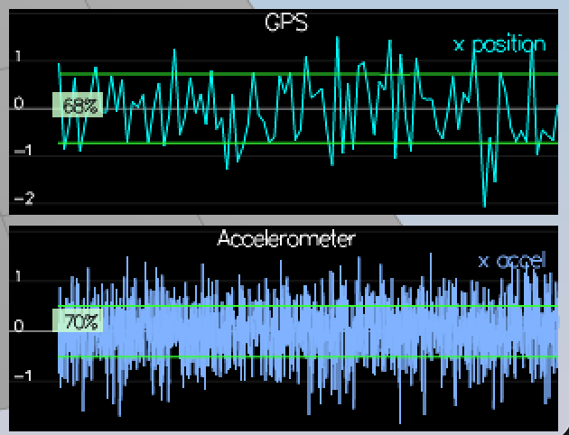
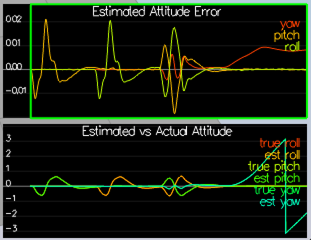
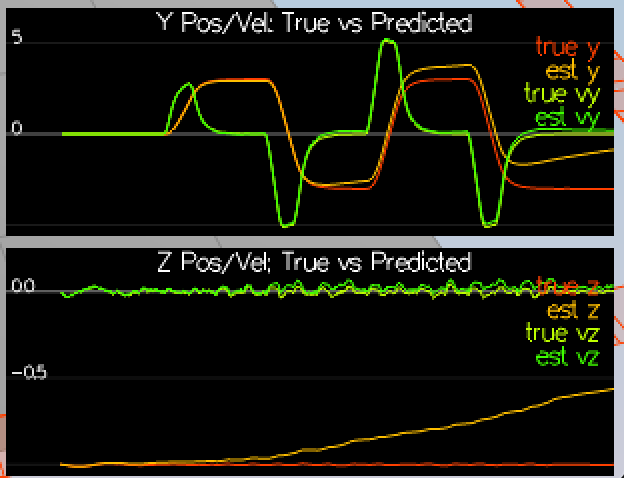
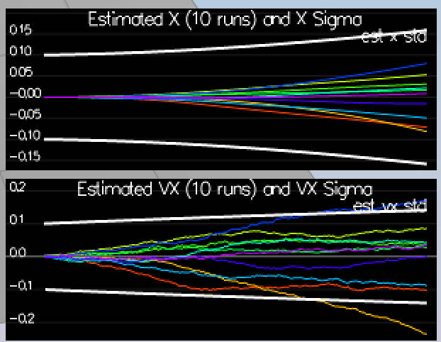
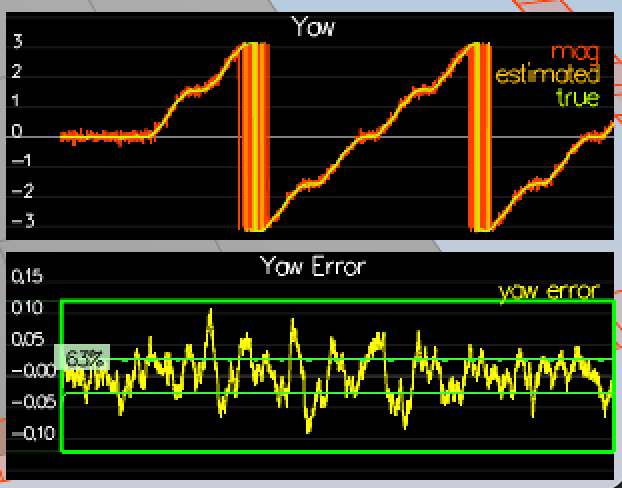
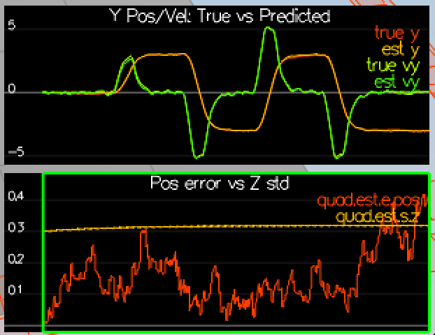
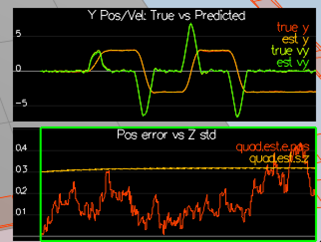

# Writeup — Estimation for Quadrotors (C++)

All work is contained in the six student-code blocks of src/QuadEstimatorEKF.cpp. The
filter parameters live in config/QuadEstimatorEKF.txt, and one identical set is used for
every scenario. The controller and its gains are the ones developed in the previous
project, copied in unchanged as src/QuadControl.cpp and config/QuadControlParams.txt.

The estimator is a seven-state EKF over (x, y, z, vx, vy, vz, yaw). Roll and pitch are not
EKF states: they are maintained separately by a non-linear complementary filter in
UpdateFromIMU(), which is why the transition Jacobian only ever needs a partial derivative
with respect to yaw. The IMU drives the prediction step at 500 Hz, while the magnetometer
and GPS supply measurement updates at their own slower rates through the shared Update()
routine.

## Sensor noise

Scenario 06_SensorNoise logs Quad.GPS.X and Quad.IMU.AX through the LogToFile graph
command. Those logs were kept as config/log/Graph1_06.csv and Graph2_06.csv, since the
simulator overwrites Graph1.txt and Graph2.txt on every later scenario. The standard
deviations were computed from the captured data rather than read out of
config/SimulatedSensors.txt, since on real hardware the noise model is exactly what is
unknown. The script calc_noise_std.py reads each log and reports the sample standard
deviation, dividing by n-1 because sigma is being estimated from a finite number of
samples. As a self-check it also reports the fraction of samples falling inside plus or
minus one sigma, which should land near the 68.3 percent a Gaussian predicts; the GPS log
gives 68.4 percent over 95 samples and the accelerometer log 69.7 percent over 1914.

The measured values are MeasuredStdDev_GPSPosXY = 0.7252 and MeasuredStdDev_AccelXY =
0.5118, written back into config/06_SensorNoise.txt. They agree with the simulator's true
PosStd of 0.7 and AccelStd of 0.5 to within four percent, which is the confirmation that
the method is sound rather than the source of the numbers. Both SigmaThreshold indicators,
which require between 64 and 73 percent of points inside the band, turn green.

*Scenario 06_SensorNoise. Both SigmaThreshold indicators sit inside the 64 to 73 percent band once the measured standard deviations are written into the config.*

## Attitude estimation

**UpdateFromIMU** (line 74). The shipped code integrated the body rates with a small-angle
approximation, adding dt * gyro.x straight onto roll and dt * gyro.y onto pitch. That is
only valid while the quad is close to level, and the box trajectory tilts it far enough
that the error grows without bound.

The replacement builds a quaternion from the current attitude estimate with
Quaternion<float>::FromEuler123_RPY(rollEst, pitchEst, ekfState(6)), advances it with
IntegrateBodyRate(gyro, dtIMU), and reads the predicted Euler angles back out through
Roll(), Pitch() and Yaw(). This is a proper non-linear integration: the body rates are
applied in the body frame they were actually measured in, instead of being treated as if
they were Euler angle rates. Yaw is written straight into ekfState(6) and wrapped to
plus or minus pi; roll and pitch are then fused with the accelerometer-derived angles by
the complementary filter already present below the student block.

With this scheme the maximum Euler angle error stays under 0.1 rad for the whole of
scenario 07_AttitudeEstimation, comfortably beating the three second requirement.

*Scenario 07_AttitudeEstimation. The quaternion integration holds the maximum Euler error below 0.1 rad for the whole run.*

## Prediction step

**PredictState** (line 150). The transition function itself, with no linearisation
anywhere. Position is advanced with the velocity held at the start of the step,
predictedState(0..2) += dt * predictedState(3..5). The accelerometer reading is rotated
from the body frame into the inertial frame with attitude.Rotate_BtoI(accel), and the
result integrated onto the velocity states. Gravity is removed on the way: the simulated
IMU reports Rotate_ItoB(acceleration + (0, 0, 9.81)), so rotating back to the inertial
frame leaves a constant +9.81 in the down axis that has to be subtracted, which is why the
z velocity line reads dt * (accel_xyz.z - CONST_GRAVITY). Yaw is deliberately left alone,
since it was already integrated in UpdateFromIMU and integrating it twice would double the
turn rate.

*Scenario 08_PredictState. The estimated position and velocity follow the true state through the box trajectory, with only the slow drift expected from pure IMU double-integration.*

**GetRbgPrime** (line 190). The partial derivative of the body-to-global rotation matrix
with respect to yaw, with roll and pitch treated as constants. Only the first two rows are
populated; the third row of Rbg is (-sin(pitch), sin(roll)cos(pitch), cos(roll)cos(pitch)),
which contains no yaw term at all, so its derivative is zero and the setZero() at the top
of the function already provides it. That zero row is a useful correctness check, and it
also carries the physical meaning: rotating about the down axis cannot change a vector's
down component, so a yaw error can never corrupt the vertical velocity estimate.

**Predict** (line 224). The covariance half of the EKF predict equations. The Jacobian
gPrime starts from setIdentity(), which is already correct for forty-three of its
forty-nine entries: every state is its own previous value plus an increment, so the
diagonal is one, and most cross terms genuinely are zero. Six entries remain. The position
rows take gPrime(0,3) = gPrime(1,4) = gPrime(2,5) = dt from the position-velocity coupling.
The velocity rows take column six from the yaw dependence, computed as RbgPrime multiplied
by the raw body-frame acceleration and scaled by dt. That acceleration enters as the
control input u, not as a state, exactly as the rubric asks; it is the untouched
accelerometer reading rather than the rotated, gravity-corrected vector used in
PredictState, because the Jacobian differentiates the transition function with respect to
the state while holding the input fixed. The covariance then follows the classic form,
ekfCov = gPrime * ekfCov * gPrime.transpose() + Q. The state assignment ekfState = newState
is left at the end of the function, since RbgPrime and gPrime must be evaluated at the
previous state for the linearisation point to be correct.

Scenario 09_PredictCovariance runs ten quads for one second each and plots the error of
every run against the filter's own sigma. The process noise was tuned to QPosXYStd = 0.05
and QVelXYStd = 0.10, which grows sigma_x from its initial 0.100 to 0.161 and sigma_vx from
0.100 to 0.141 over the one second window. That envelope tracks the spread of the ten error
traces, with roughly the expected minority of runs falling outside the band rather than the
filter being made artificially conservative enough to contain all of them.

*Scenario 09_PredictCovariance. The white sigma envelope opens at roughly the rate the ten error traces spread.*

## Magnetometer update

**UpdateFromMag** (line 321). The magnetometer observes yaw directly, so the measurement
model is the identity on a single state: zFromX(0) = ekfState(6) and hPrime(0,6) = 1. The
column index matters, since yaw is state six; putting the one in column zero would tell the
filter that the magnetometer measures x position and would corrupt the position estimate on
every update.

The one subtlety is the angle wrap. Both the estimate and the measurement are individually
inside plus or minus pi, so neither one needs normalising on its own, but their difference
does not: an estimate of +3.10 rad against a measurement of -3.10 rad is a real error of
0.08 rad and an apparent error of -6.20 rad. The code therefore forms diff = z(0) -
zFromX(0) and shifts the measurement by a full turn when that difference leaves the
interval, moving z onto the branch nearest the estimate so Update() always corrects the
short way around the circle.

QYawStd was tuned to 0.07. Scenario 10_MagUpdate applies two criteria: a WindowThreshold
requiring the yaw error to stay under 0.12 rad for ten seconds, and a SigmaThreshold
requiring between 55 and 85 percent of samples to lie inside plus or minus sigma. The
second is the one QYawStd controls, and because it is bounded on both sides it cannot be
satisfied by simply inflating the process noise. At the shipped value of 0.05 the indicator
read 50 percent, just under the floor, meaning the filter was slightly overconfident;
raising QYawStd to 0.07 widens sigma enough to bring the figure into range and both
indicators turn green.

*Scenario 10_MagUpdate. The WindowThreshold box and the SigmaThreshold percentage readout are both green at QYawStd = 0.07.*

## GPS update

**UpdateFromGPS** (line 290). GPS measures the first six states directly, so the
observation function is the identity map and its Jacobian is a six by six identity block
padded with a zero seventh column for yaw, which GPS cannot see. The implementation is the
loop that sets zFromX(i) = ekfState(i) and hPrime(i, i) = 1 for i below six. Everything
else is handled by the shared Update() routine, which forms the Kalman gain
K = Sigma * H' * (H * Sigma * H' + R)^-1, applies the innovation to the state and shrinks
the covariance; R_GPS is built in Init() from the GPSPosXYStd, GPSPosZStd, GPSVelXYStd and
GPSVelZStd parameters and needs no further work.

Scenario 11_GPSUpdate was run in the two stages the project describes. First with
Quad.UseIdealEstimator set to 0 but the IMU still ideal, which exercises the new update
path in isolation, and then with the SimIMU.AccelStd and SimIMU.GyroStd overrides commented
out so the realistic noise from config/SimulatedSensors.txt applies. In both cases the
position error stays within roughly 0.05 to 0.3 m against a 1 m threshold, and Quad.Est.S.Z
settles to a steady 0.3 rather than climbing, which is the signature of the prediction
growth and the GPS correction reaching equilibrium.

*Scenario 11_GPSUpdate with realistic sensors and the provided controller. Position error stays far inside the 1 m threshold and Quad.Est.S.Z levels off at 0.3.*

## Flight evaluation

Every scenario passes with a single parameter set: 06_SensorNoise, 07_AttitudeEstimation,
08_PredictState, 09_PredictCovariance, 10_MagUpdate and 11_GPSUpdate, the last with the
realistic IMU and the estimator in the loop. The final values are QPosXYStd = 0.05,
QPosZStd = 0.05, QVelXYStd = 0.10, QVelZStd = 0.1 and QYawStd = 0.07; the measurement
covariances and initial standard deviations were left at their shipped values.

The controller from the previous project was then copied in and scenario 11 re-run. No
de-tuning was required: src/QuadControl.cpp and config/QuadControlParams.txt are
byte-identical to the versions submitted for the controls project, and the box trajectory
still flies with the position error between 0.05 and 0.3 m, well inside the 1 m budget for
the full twenty seconds. The corner overshoots are marginally larger than with the provided
controller but recover just as quickly, with no oscillation and no accumulating drift. The
gain set is kpPQR = 70, 79, 10 and kpBank = 14 on the inner loops, kpPosXY = 30 with
kpVelXY = 12 laterally, and kpPosZ = 26.6, kpVelZ = 16, KiPosZ = 48 on altitude. These are
stiff gains, so the margin was not obviously there in advance; the factor of roughly five
between the body rate loop and the attitude loop appears to be what keeps the noise on the
estimated attitude from reaching the rate loop as a command it tries to chase.

*Scenario 11_GPSUpdate flown with the controller from the previous project, unmodified. The error budget is met for the full twenty seconds.*
